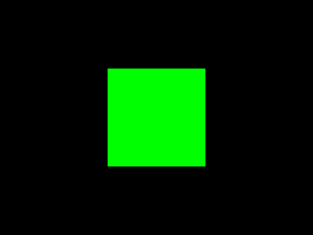
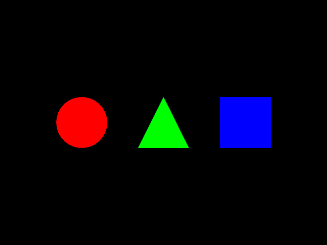
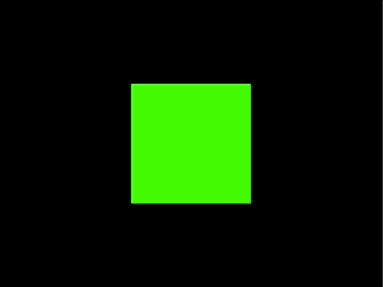
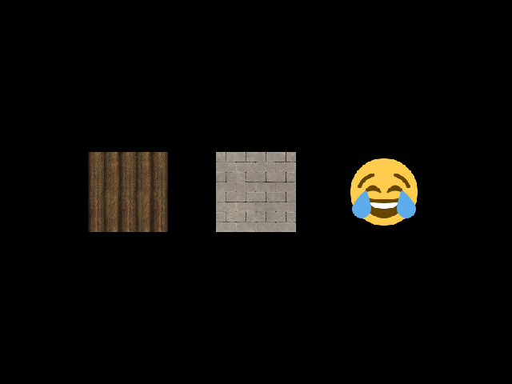

# Yehat

Yehat is a game engine built on WebGL.

🚧 The engine is still a work in progress but it can be used to draw some basic 2D graphics.

There are three major versions of the engine: v1, v2 and v3.

Version 3 is the most recent one and the more simple examples are already written using it. But the more complex game examples still use version 2.

## Getting started

🚧 Because yehat is a work in progress it has not been published anywhere. Right now you can just copy the code from this repo or add a new workspace to this repo.

First you need a web page. For example:

`index.html`:

```html
<!DOCTYPE html>
<html lang="en">
  <head>
    <meta charset="utf-8" />
    <title>Yehat Hello World example</title>
    <script type="module" src="app.ts"></script>
  </head>
  <body style="background-color: dimgray">
    <canvas id="glcanvas" width="640" height="480"></canvas>
  </body>
</html>
```

Here the app code in injected with a `<script>` tag and from `app.ts`. This works when using [parcel](https://parceljs.org/) like is done for all the yehat examples. You also need a `<canvas>` element which is referenced in the app code.

Then in the app code we bootstrap yehat to the `<canvas>` element and run the game:

`app.ts`:

```ts
import { Effect, pipe } from "effect";

import {
  GameObject,
  Rectangle,
  Vector2,
  Vector4,
  WglGameScene,
  WglRenderingContext,
  Yehat,
  YehatGlobal,
} from "@yehat/yehat/src/v3";

const createScene = (): WglGameScene.BaseGameScene => ({
  bgColor: Vector4.make(0, 0, 0, 1),
  textures: new Map(),
  gameObjects: [
    // Add game objects here
  ],
});

const updateScene =
  (_currentMs: number) =>
  (scene: WglGameScene.WglGameScene): WglGameScene.WglGameScene =>
    scene; // We can also return an updated scene

const app = pipe(
  document,
  WglRenderingContext.fromCanvasWithId("glcanvas"),
  Effect.flatMap(Yehat.runGame(createScene)(updateScene)(Yehat.renderScene))
);

pipe(
  window,
  YehatGlobal.addEventListener("load", () =>
    Effect.runPromise(app).catch(console.error)
  )
);
```

Version 3 of yehat is using [effect](https://effect.website/) library. It is a peer dependency so all apps using yehat need to also install effect. The way we run an application in effect is by calling `Effect.runPromise()`. Yehat also provides built-in functions for some Web APIs which wrap errors into the `Effect` type. One of them is `YehatGlobal.addEventListener()` which is used here to add a listener to the document `load` event. Here it is used to make sure the whole document is loaded before the code is run.

The app itself is a function which gets the `WebGLRenderingContext` from the `<canvas>` element on the HTML page and then passes it to the `Yehat.runGame()` function. The `Yehat.runGame()` function also takes three first parameters which are functions `createScene`, `updateScene` and `renderScene`. These three functions form the MVU (model view update) architecture which is a core part of yehat. The basic idea is taken from the [ELM architecture](https://guide.elm-lang.org/architecture/).

First function `createScene` creates the game scene (model or M in the MVU architecture). This scene will contain all the data needed to render the game. In the example we have a background color to clear the scene and collections for the textures and game objects. Here they are empty but in the examples you can see how to add them. The scene can also contain any additional game data by extending the `WglGameScene.BaseGameScene` type.

Second function `updateScene` is responsible for changes in the game scene (update or U in the MVU architecture). Here we don't need to change anything but in the examples the scene changes for example for animations, physics and user input.

Third function `renderScene` takes the model and renders it into WebGL graphics (view or V in MVU architecture). Here we use the `Yehat.renderScene` default render function from yehat.

## Examples

### 1. Hello World

This is the simplest example of rendering a rectangle shape with green color.

`createScene` function:

```ts
const createScene = (): WglGameScene.BaseGameScene => ({
  bgColor: Vector4.make(0, 0, 0, 1),
  textures: new Map(),
  gameObjects: [
    pipe(
      Rectangle.create(Vector2.make(200, 200)),
      GameObject.setPosition(Vector2.make(220, 140)),
      GameObject.setColor(Vector4.make(0, 1, 0, 1))
    ),
  ],
});
```



### 2. Shapes

This is an example of drawing different shapes with different colors.

`createScene` function:

```ts
const createScene = (): WglGameScene.BaseGameScene => ({
  bgColor: Vector4.make(0, 0, 0, 1),
  textures: new Map(),
  gameObjects: [
    pipe(
      Circle.create(Vector2.make(100, 100)),
      GameObject.setPosition(Vector2.make(110, 190)),
      GameObject.setColor(Vector4.make(1, 0, 0, 1))
    ),
    pipe(
      Triangle.create(Vector2.make(100, 100)),
      GameObject.setPosition(Vector2.make(270, 190)),
      GameObject.setColor(Vector4.make(0, 1, 0, 1))
    ),
    pipe(
      Rectangle.create(Vector2.make(100, 100)),
      GameObject.setPosition(Vector2.make(430, 190)),
      GameObject.setColor(Vector4.make(0, 0, 1, 1))
    ),
  ],
});
```



### 3. Animation

This is an example of motion or animation can be added to the game.

`GameScene` type and `createScene` function:

```ts
interface GameScene {
  bgColor: Vector4.Vector4;
  currentAngle: number;
  degreesPerMs: number;
  previousMs: Option.Option<number>;
  textures: Map<number, string>;
  gameObjects: GameObject.GameObject[];
}

type AnimationWglGameScene = WglGameScene.WglGameScene<GameScene>;

const createScene = (): GameScene => ({
  bgColor: Vector4.make(0, 0, 0, 1),
  currentAngle: 0,
  degreesPerMs: 90 / 1000,
  previousMs: Option.none<number>(),
  textures: new Map(),
  gameObjects: [
    pipe(
      Rectangle.create(Vector2.make(200, 200)),
      GameObject.setPosition(Vector2.make(220, 140)),
      GameObject.setColor(Vector4.make(0, 1, 0, 1))
    ),
  ],
});
```

`updateScene` function:

```ts
const updateScene =
  (currentMs: number) =>
  (scene: AnimationWglGameScene): AnimationWglGameScene =>
    pipe(
      scene.previousMs,
      Option.map((previousMs) => currentMs - previousMs),
      Option.getOrElse(() => 0),
      (elapsedMs) => elapsedMs * scene.degreesPerMs,
      (deltaAngle) => (scene.currentAngle + deltaAngle) % 360,
      (newAngle) => ({
        ...scene,
        previousMs: Option.some(currentMs),
        currentAngle: newAngle,
        gameObjects: scene.gameObjects.map((gameObject) => ({
          ...gameObject,
          rotation: pipe(newAngle, Radian.fromDegrees, Vector2.fromRadians),
        })),
      })
    );
```



### 4. Textures

This is an example of applying textures to the game objects.

```ts
const createScene = (): WglGameScene.BaseGameScene => ({
  bgColor: Vector4.make(0, 0, 0, 1),
  textures: new Map([
    [Textures.Wood, "assets/textures/wood_0.png"],
    [Textures.Square, "assets/textures/brick_2.png"],
    [Textures.Joy, "assets/textures/joy.png"],
  ]),
  gameObjects: [
    pipe(
      Rectangle.create(Vector2.make(100, 100)),
      GameObject.setPosition(Vector2.make(110, 190)),
      GameObject.setTexture(Option.some(Textures.Wood))
    ),
    pipe(
      Rectangle.create(Vector2.make(100, 100)),
      GameObject.setPosition(Vector2.make(270, 190)),
      GameObject.setTexture(Option.some(Textures.Square))
    ),
    pipe(
      Rectangle.create(Vector2.make(100, 100)),
      GameObject.setPosition(Vector2.make(430, 190)),
      GameObject.setTexture(Option.some(Textures.Joy))
    ),
  ],
});
```



### Writing your own example

Currently this library isn't released through package management repo like NPM, but you can fork this repo and make a new example to try the library.

Easiest way is to copy `hello-world` example into a new directory. Something like:

```sh
cp -r ./examples/hello-world ./examples/your-example
```

Then you need to change the `name` of the package in `package.json` to be `@yehat/example-your-example` so it doesn't conflict with the original `hello-world` example. You can also change the `description` in `package.json` and `<title>` element of `index.html`.

You can then run the example with `yarn start` in the `examples/your-example` directory. You can also add a script to the root `package.json` like this:

```json
{
  "scripts": {
    // ... omitted other scripts
    "start:your-example": "yarn workspace @yehat/example-your-example start"
    // ...
  }
}
```
